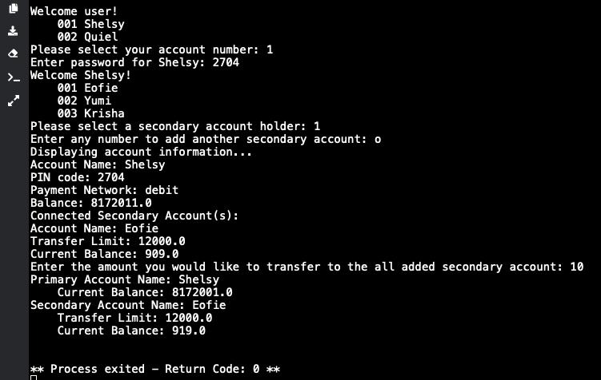
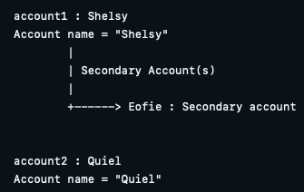

# Class Relationships: Association and Multiplicity
## Previous Work
[Part I - Classes and Objects](https://github.com/betdeleon-crypto/9berylliumcs3/blob/19548fc76d03b4cefee11aa9ddb9643b0c576b4d/quarter%201/classObjectUML.md)

[Part II - Class Attributes and Methods](https://github.com/betdeleon-crypto/9berylliumcs3/blob/19548fc76d03b4cefee11aa9ddb9643b0c576b4d/quarter%201/classAttributesMethods.md)

## Existing Class
Class: __Bank Account__

Description: A software storage system where simple banking processes are performed. Information included here are the personal details of the primary account holder and their current bank balance.

## New Related Class
Class: __Secondary Bank Account__

Description: Similar to the Bank Account class, the Secondary class allows for simple banking processes to be performed. 
It comprises the details of a secondary account holder and allows for easier bank processes involving both accounts.

## Association
Relationship:

Explanation:
## Multiplicity
Multiplicity:

Explanation:

## UML Class Relationship Diagram

## Python Implementation
[View Python Source](https://github.com/betdeleon-crypto/9berylliumcs3/blob/75d958ce6a48adcd1cc16fb798fd325d222fea9c/quarter%201/classRelationships.py)

## Test Run

## Object Relationship Diagram

## Analysis
### What is the association between your two classes?
### What multiplicity did you choose and why?
### How did you implement the relationship in Python?
### Why did you store an object reference instead of copying its data?
### If your relationship uses many, why is a list appropriate?
